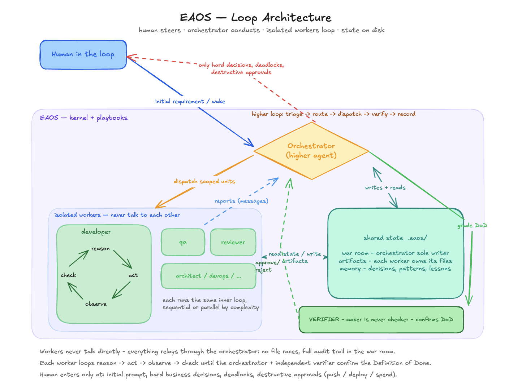

# Engineering Agentic OS (EAOS)

A portable "operating system" that runs software engineering work as a **collaborating team
of AI agents** — architect, developer, QA, security, devops, SRE, reviewer — coordinated by an
orchestrator that runs a real engineering loop (understand → plan → build → review → test →
ship → stabilize) and pulls in only the agents a task actually needs.


*The Claude Code standard/complex path: human at the gates, orchestrator's higher loop,
isolated workers, shared `.eaos/` state, independent verifier.*

## Quickstart (Claude Code)

```bash
git clone https://github.com/AmbitiousSam/eng-agent-os.git && cd eng-agent-os
./setup.sh                  # installs command, personas, skills, config, eaos CLI into ~/.claude
./scripts/eaos-doctor.sh    # verify (or: make doctor)
```

Restart Claude Code, then from inside any project:

```
/agentic-os Add per-API-key rate limiting to our public REST API
```

That's the whole interface. It runs autonomously and stops only at defined human gates:
blocking product decisions, deadlocks, and destructive actions (push / deploy / migrate / spend).

## The trust model

- **Bookkeeping is code, not prose.** The `eaos` runtime CLI enforces spawn budgets, loop-back
  ceilings, gate checks, and an evidence-mandatory Definition-of-Done table with **binding exit
  codes** — a final report cannot be produced while any acceptance criterion is unverified.
- **Maker is never checker.** A fresh-context verifier grades every criterion with evidence
  before a standard/complex task can complete.
- **Everything is auditable files.** War room, artifacts, decisions, and memory live in
  `./.eaos/` in your project — resumable across sessions and tools.
- **Judgment stays human-steerable.** Routing, design convergence, and review quality are
  prompts you can read and edit; the CLI does bookkeeping, not thinking.

## Where it runs

| Tool | What you get |
|---|---|
| **Claude Code** | The full team: isolated subagents, parallelism by complexity, model tiers, fresh verifier |
| **Cursor / Codex / Windsurf-Devin / any AGENTS.md tool** | [Solo mode](adapters/solo-mode.md): one grounded, disciplined agent + the `eaos` CLI's DoD enforcement — honest about what degrades ([why](adapters/README.md)) |

The `.eaos/` state and the `eaos` CLI port everywhere; start a task in Claude Code, resume it
in Cursor.

## Documentation

**[📖 The wiki](https://github.com/AmbitiousSam/eng-agent-os/wiki)** — Quickstart, Architecture,
Runtime CLI, IDE Adapters, Playbooks & Routing, Memory & State, Trust & Evals, Customizing.

In-repo: [`AGENT_OS.md`](AGENT_OS.md) (full design doc) · [`ROADMAP.md`](ROADMAP.md) ·
[`adapters/`](adapters/) · [`docs/EVAL-PROTOCOL.md`](docs/EVAL-PROTOCOL.md) ·
[`CUSTOMIZE.md`](CUSTOMIZE.md) · [`RUN.md`](RUN.md)

## Develop / validate

```bash
make doctor      # install + project readiness
make test        # shell syntax + structural validator + eval fixture + CLI unit tests
```

## License / attribution

Builds on and installs [`agency-agents`](https://github.com/msitarzewski/agency-agents) (MIT).
EAOS is the coordination layer; agency-agents supplies extra specialist personas.
