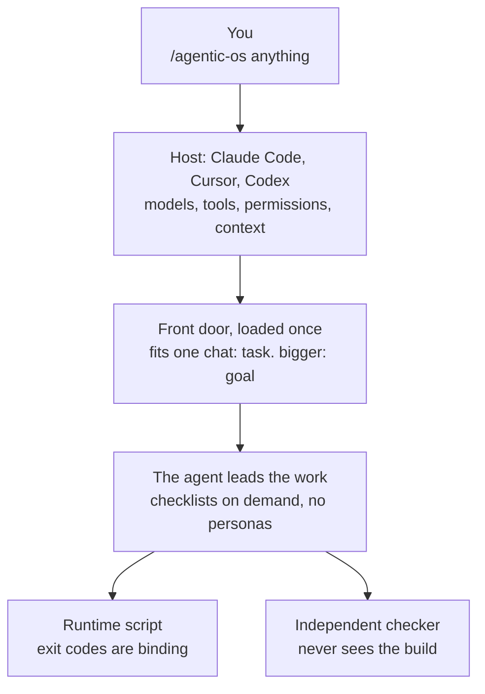
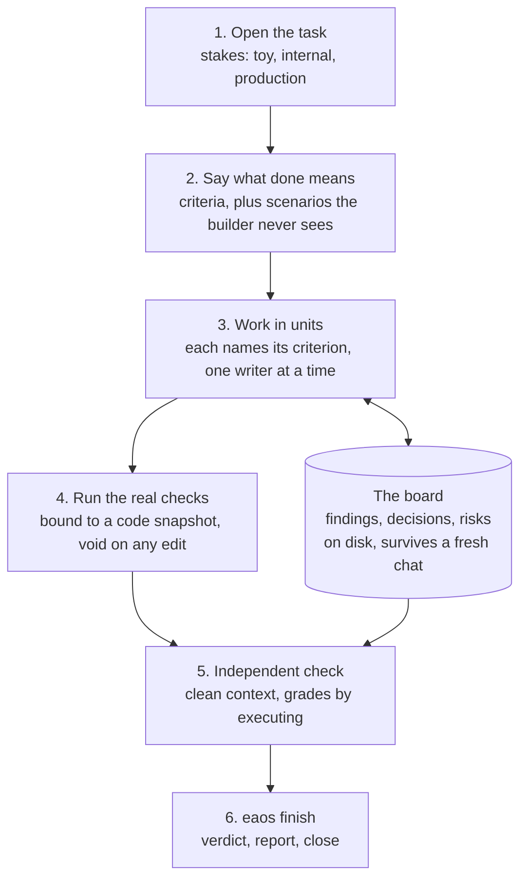
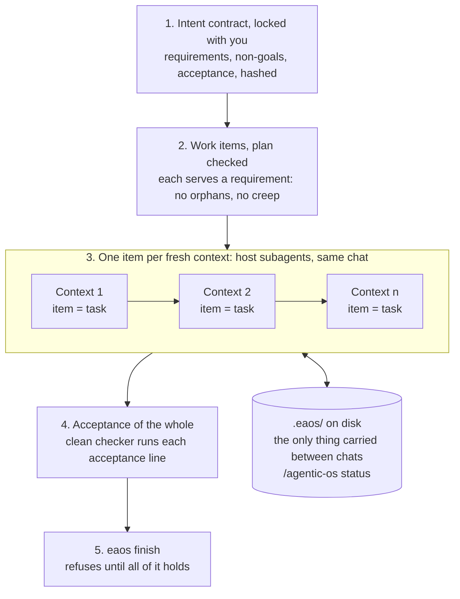

# Engineering Agentic OS (EAOS)

A small layer for coding agents. The model leads. EAOS supplies the three things a model cannot
give itself, and enforces them with a script whose exit codes the agent cannot argue with:

1. **Working state that outlives a context.** A typed board on disk, so a fresh chat or a parallel
   worker sees what its siblings found.
2. **A check made without the maker's reasoning.** A clean-context checker grades the acceptance
   criteria, the open risks and **scenarios** written before any code and hidden from the builder.
3. **Evidence that cannot be talked into existence.** Check results are bound to a code snapshot and
   void when the code changes. Nothing that did not execute is `verified`. A task nobody judged
   cannot close.

Works in **Claude Code, Cursor and Codex**. No personas, no phase pipeline.



The host is the operating system. EAOS is the part that decides what counts as done: the agent
reasons freely and cannot argue with the last two boxes.

## Install

```bash
curl -fsSL https://raw.githubusercontent.com/AmbitiousSam/eng-agent-os/main/install.sh | bash
```

That is the whole install. It needs `git` and `python3`, takes a few seconds, and is safe to re-run
(re-running is also how you update). It works globally: nothing is copied into your projects.

Then open any repository and type:

| Host | Type this |
|---|---|
| Claude Code | `/agentic-os <your task>` (restart Claude Code once after the first install) |
| Cursor | `/agentic-os <your task>` |
| Codex | `$agentic-os <your task>` |

Follow-up messages are plain conversation. Do not re-type the command in the same chat.

### If you are an AI agent asked to install EAOS

Run exactly the one command above in a terminal. Success is the line `Healthy.` near the end of its
output. Do not clone manually, edit settings files or copy anything into the user's project. If the
command fails, show the user its last ten lines and stop. To verify later:
`bash ~/.eaos-src/eaos/runtime/eaos-doctor.sh`.

### What the installer puts where

| Path | What | Used by |
|---|---|---|
| `~/.eaos-src/` | this repository (the installer updates it with `git pull`) | installer |
| `~/.claude/commands/agentic-os.md` | the front door | Claude Code |
| `~/.claude/agents/eaos-{builder,reader,checker}.md` | three boundaries the host spawns as subagents | Claude Code, Cursor |
| `~/.agents/skills/agentic-os/SKILL.md` | the same front door as a global skill, generated at install | Cursor, Codex |
| `~/.claude/eaos/` | the runtime script, checklists, templates, config | every host |
| `~/.claude/settings.json` | four hook entries, only if Claude Code is installed; the file is backed up first | Claude Code |

In your projects EAOS writes one folder, `.eaos/`, holding task state. Add it to `.gitignore` or
commit it, your choice.

Options: `EAOS_NO_HOOKS=1` skips the hooks, `EAOS_REF=v4.5.1` pins a release, `EAOS_SRC=<dir>` moves
the checkout. Working from a clone instead: `./setup.sh`, then optionally
`./eaos/runtime/install-eaos-hooks.sh`.

## Upgrading from an older version (v1, v2, v3)

Run the same one-line install. It removes what older versions put on the machine before installing
the current one: the persona agents and the `agency-*` library, the old `/agent-os`, `/incident` and
`/triage` commands, the playbooks, the old skills, `protocol.md`, `loop.md`, `orchestrator.md`.

The rule is strict so that nothing of yours is lost: a file is **deleted only if it is byte-identical
to what EAOS shipped**. Anything you edited, and anything at one of those paths that EAOS never
shipped, is **moved** to `~/.claude/eaos/quarantine/<timestamp>/` with a `MANIFEST.txt` listing what
moved. Your projects' `.eaos/` folders are never touched; old task records stay readable.

To see the plan before anything changes:

```bash
git clone https://github.com/AmbitiousSam/eng-agent-os.git ~/.eaos-src
bash ~/.eaos-src/setup.sh --dry-run     # prints every removal and quarantine, changes nothing
```

Then run the one-line install, and restart Claude Code. If you had cloned the repository somewhere
yourself for an older version, that clone is no longer used (the installer keeps its own at
`~/.eaos-src`); delete it when you like. The old version stays available on branch `v3`.

## Uninstall

```bash
bash ~/.eaos-src/setup.sh --uninstall
```

This removes **every EAOS version** from the machine: the hook entries in `~/.claude/settings.json`
(the file is backed up first), the command, the three agents, the global skill, the runtime,
checklists and templates, and any leftovers from v1 to v3 under the same delete-or-quarantine rule.
It keeps what is yours: each project's `.eaos/` folder, the scenario store
(`~/.claude/eaos/scenarios/`) and the quarantine folder. To finish, delete those if you want them
gone, then `rm -rf ~/.eaos-src`. Restart Claude Code afterwards.

## What a task looks like



You type the task. The agent then, on its own:

1. Opens a task with a stakes level: `toy`, `internal` or `production`. Stakes decide how much
   process sits between start and finish, nothing else.
2. Records acceptance criteria. At internal stakes and above it also writes scenarios, stored outside
   the workspace where the builder will not look.
3. Works in units. Findings, decisions and risks go on the board, not into its own narration.
4. Runs the project's real test, lint, type and build commands through the runtime, which binds each
   result to the current code snapshot.
5. Hands the result to an independent checker that never sees how it was built: the `eaos-checker`
   subagent, which the host starts in its own fresh context. Claude Code and Cursor both load it from
   `~/.claude/agents/`. Nothing for you to paste or open.
6. Closes with a verdict the runtime computes (`verified`, `conditional-manual`, `partial`,
   `unverified`) and a final report: asked, built, checked with proof, decided, not done, needs you.

### When the ask is bigger than one chat

Same command. The agent recognises a product, a feature set or a backlog and opens a **goal**:



1. It writes an **intent contract** (requirements, constraints, non-goals, acceptance), shows it to
   you, and locks it by hash once you agree. Later changes need a recorded reason.
2. It breaks the goal into work items. Each item names the requirement it serves. The runtime refuses
   a plan with a requirement nobody serves or an item that serves nothing.
3. Each item runs as a normal task in **its own fresh context**, so the goal never becomes one giant
   transcript: the agent hands each item to a builder subagent, then a checker subagent, and keeps
   going in the same chat until its context ceiling. Then you type `/agentic-os next` in a new chat.
4. `/agentic-os status` prints requirement, items, verdicts, evidence.
5. At the end an independent checker grades the acceptance lines against the finished whole. A goal
   cannot finish while an item failed, a requirement is unserved, or an acceptance line is ungraded.

**Where you are still asked, on purpose:** your yes before an intent contract is locked, and the human
gates below. Everything between those runs without you.

It always stops for you before: push or merge to a shared branch, deploy, migration, spending money,
deleting data, rewriting history on a branch the task did not create.

You never run the runtime script. The agent does, the way it runs `git`.

## What differs per host

| Capability | Claude Code | Cursor, Codex |
|---|---|---|
| Board, snapshot-bound evidence, scenarios, verdict rules, refusals | enforced | enforced (same script) |
| Builder, parallel readers, independent checker | host subagents | host subagents (Cursor loads the same `~/.claude/agents/`) |
| Goals: locked intent, item traceability, acceptance of the whole | enforced | enforced (same script) |
| Scenario store unreachable by tools; one writer per workspace | hooks (not against a disguised shell command or `sed`) | not available |
| Spawn budget, session binding, stop-time audit, context size | hooks | not available |

`eaos/adapters/README.md` has the full table. EAOS does not manage agents: the host spawns them.

## Status, honestly

v4.5.1. Thirteen real runs on a private production codebase were reviewed and every defect they
exposed was fixed (`lab/evals/results/2026-09-18-v4-first-runs.md`). In those runs the checker caught
real bugs three times, no session compacted, and tasks used 1 to 4 subagents.

The goal level (v4.3.0) passes its tests but has not yet completed a real multi-item goal.

Not yet shown: that EAOS beats the same model with no EAOS. The controlled experiment is
pre-registered and its grader is built, but it has not been run. The Cursor and Codex path is built
from their documented skill loading and has not been exercised on a real task. Developed and tested
on macOS. Read `lab/EVAL-PROTOCOL.md` before believing any claim here, including this one.

## Repository map

Three folders. The product is `eaos/`, about thirty files, and it is all the installer copies.

| Path | What |
|---|---|
| `install.sh`, `setup.sh` | one-step installer; the installer proper (`--dry-run`, `--uninstall`) |
| `eaos/agentic-os.md` | the front door, about 100 lines, loaded once per context |
| `eaos/agents/` | builder, reader, checker: tool-scoped boundaries, no personas |
| `eaos/checklists/` | twelve, loaded on demand: goal, intake, build, research, review, security, test-adequacy, verdict, deploy-rehearsal, operability, incident, reporting |
| `eaos/runtime/` | `eaos` (the script the agent runs), the Claude Code hook and its installer, doctor, `routing.yaml` |
| `eaos/adapters/` | the header for the Cursor and Codex skill, and the per-host capability table |
| `eaos/templates/` | final report, ADR, task spec, test plan and the other documents the checklists name |
| `tests/` | `run.sh` runs everything: runtime tests, hook tests, installer tests, repo validator |
| `lab/` | not product: specs, research, review records, experiment protocol, measured results |

v3 (personas and playbooks) is preserved on branch `v3`, release v3.0.0.
